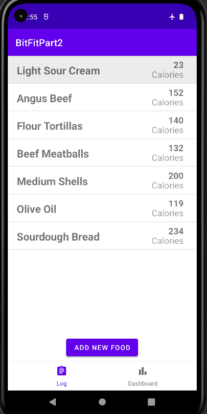

# Android Lab Unit 5 - *ArticleSearchPt2*

Submitted by: **Jerry Belardino**

**ArticleSearchPt2** is an android app that displays the most recent articles from the NYTimes API and can function without an internet connection

Time spent: **2** hours spent in total

## Required Features

The following **required** functionality is completed:

* [x] Displays the most recent articles from the NYTimes api
* [x] Users can click on an article to get more details
* [x] The app functions without an internet connection

## Video Walkthrough

Here's a walkthrough of implemented features:

GIF created with ScreenToGif

## Notes

## License

    Copyright [yyyy] [name of copyright owner]

    Licensed under the Apache License, Version 2.0 (the "License");
    you may not use this file except in compliance with the License.
    You may obtain a copy of the License at

        http://www.apache.org/licenses/LICENSE-2.0

    Unless required by applicable law or agreed to in writing, software
    distributed under the License is distributed on an "AS IS" BASIS,
    WITHOUT WARRANTIES OR CONDITIONS OF ANY KIND, either express or implied.
    See the License for the specific language governing permissions and
    limitations under the License.
